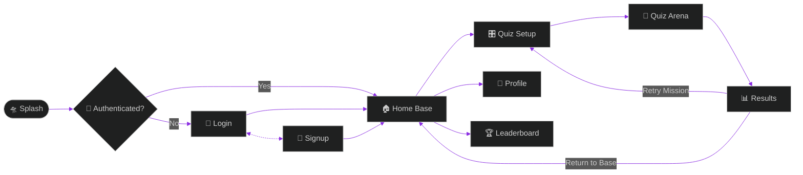
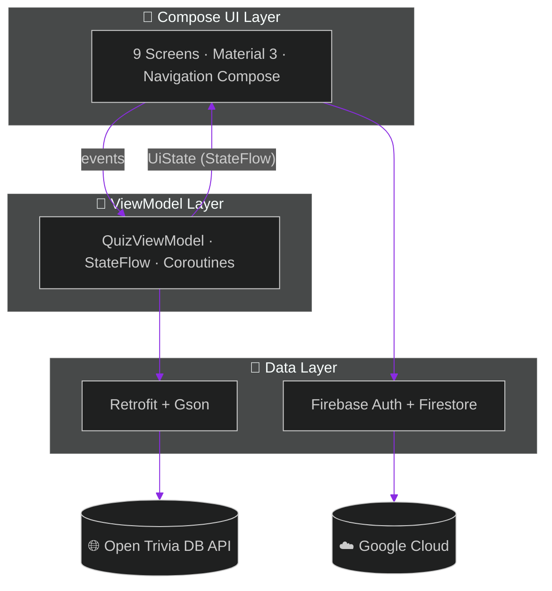

<div align="center">

<!-- ═══════════════════════ ANIMATED HEADER ═══════════════════════ -->


<!-- ═══════════════════════ TYPING ANIMATION ═══════════════════════ -->
<a href="https://github.com/dashashutosh9090/BrainQuest">
  
</a>

<br/><br/>

<!-- ═══════════════════════ BADGE WALL ═══════════════════════ -->


<br/>


<br/><br/>


</div>

<!-- ═══════════════════════ ANIMATED DIVIDER ═══════════════════════ -->


## 🛰️ Mission Briefing

```text
 ╔══════════════════════════════════════════════════════════╗
 ║  > BOOTING BRAINQUEST v1.0 .......................       ║
 ║  > NEURAL LINK ..................... ✓ ONLINE            ║
 ║  > FIREBASE UPLINK ................. ✓ CONNECTED         ║
 ║  > QUESTION DATABASE ............... ✓ 24 SECTORS LOADED ║
 ║  > DIFFICULTY MATRIX ............... ✓ EASY→MEDIUM→HARD  ║
 ║  > LEADERBOARD SATELLITE ........... ✓ IN ORBIT          ║
 ║                                                          ║
 ║        ALL SYSTEMS GO. WELCOME, CHALLENGER. 🚀           ║
 ╚══════════════════════════════════════════════════════════╝
```

**BrainQuest** is a sleek, modern Android trivia app that turns knowledge into competition. Pick your battlefield from **24 categories** — from 🧬 Science to 🎮 Video Games to 🏛️ Mythology — tune the difficulty, and battle through questions streamed live from the [Open Trivia Database](https://opentdb.com/). Every score is beamed to a **global Firestore leaderboard**, so the fight for Rank #1 never ends.


## ⚡ Feature Matrix

<table>
<tr>
<td width="50%">

### 🔐 Secure Access Terminal
Email/password authentication powered by **Firebase Auth** — sign up, log in, and your identity travels with you.

### 🎛️ Quiz Configurator
Dial in your mission parameters:
- 🗂️ **24 categories** + random mode
- 🌡️ **3 difficulty levels** (Easy / Medium / Hard)
- ❓ **Question types** — Multiple Choice or True/False
- 🔢 **1–50 questions** per run

### 🧠 Live Question Engine
Questions fetched in real time via **Retrofit + Gson** from Open Trivia DB, with graceful error handling for lost signals.

</td>
<td width="50%">

### 🏆 Global Leaderboard
Three ranking dimensions, all synced through **Cloud Firestore**:
- 💯 Total Score
- 📊 Average Score
- 🥇 Best Score

### 📡 Command Center (Home)
Your personal HQ — total quizzes flown, global rank, and a feed of your recent missions with timestamps.

### 👤 Pilot Profile
Track your identity and stats across sessions.

### 🌌 Fluid UI
100% **Jetpack Compose** + **Material 3** with edge-to-edge rendering and smooth navigation transitions.

</td>
</tr>
</table>


## 🚀 Navigation Star Map



## 🧬 System Architecture




## 🛠️ Tech Arsenal

<div align="center">


| System | Technology | Version |
|:------:|:-----------|:-------:|
| 🚀 **Language** | Kotlin | `2.2.0` |
| 🎨 **UI Toolkit** | Jetpack Compose (Material 3) | `BOM 2025.07.00` |
| 🧭 **Navigation** | Navigation Compose | `2.9.2` |
| 🔥 **Backend** | Firebase Auth · Firestore · Analytics | `BOM 34.0.0` |
| 📡 **Networking** | Retrofit + Gson Converter | `3.0.0` |
| 🏗️ **Build System** | Gradle (Kotlin DSL) + AGP | `8.11.1` |
| 🧪 **Testing** | JUnit · Espresso · Compose UI Test | — |

</div>

## 📂 Project Coordinates

```text
🛸 BrainQuest/
├── 📱 app/src/main/java/com/axu/brainquest/
│   ├── 🚀 MainActivity.kt            → Launch pad + NavHost
│   └── 🎨 ui/
│       ├── 🛸 SplashScreen.kt        → Boot sequence
│       ├── 🔐 LoginScreen.kt         → Access terminal
│       ├── 📝 SignupScreen.kt        → New pilot registration
│       ├── 🏠 HomeScreen.kt          → Command center + stats
│       ├── 🎛️ QuizSetupScreen.kt     → Mission configurator
│       ├── 🧠 QuizScreen.kt          → The arena
│       ├── 📊 ResultScreen.kt        → Mission debrief
│       ├── 👤 ProfileScreen.kt       → Pilot dossier
│       ├── 🏆 LeaderboardScreen.kt   → Hall of legends
│       ├── ⚙️ QuizViewModel.kt       → State engine + OpenTDB API
│       ├── 🧩 components/            → Shared UI components
│       └── 🌈 theme/                 → Colors · Typography · Theme
└── 📦 *.apk                          → Ready-to-fly builds
```


## 🧑‍🚀 Launch Sequence (Getting Started)

> **Pre-flight checklist:** Android Studio (latest), JDK 11+, Android SDK 36, and a device/emulator on API 24+.

```bash
# 1️⃣  Clone the mothership
git clone https://github.com/dashashutosh9090/BrainQuest.git
cd BrainQuest

# 2️⃣  Open in Android Studio and let Gradle sync

# 3️⃣  Ignite engines
./gradlew assembleDebug

# 4️⃣  Deploy to your device
./gradlew installDebug
```

> 🔥 **Firebase note:** the project ships with a `google-services.json`. To point at **your own** Firebase project, create one in the [Firebase Console](https://console.firebase.google.com/), enable **Email/Password Auth** + **Cloud Firestore**, and drop your `google-services.json` into `app/`.

### 📦 Instant Deploy

No build tools? Grab a pre-built APK straight from the repo:

<div align="center">

[](https://github.com/dashashutosh9090/BrainQuest/raw/master/BrainQuest-release.apk)

</div>

## 📸 Visual Transmission

<details>
<summary>🖼️ <b>Click to expand screenshots</b> <i>(incoming transmission...)</i></summary>
<br/>

> 📡 Screenshots are being beamed down from orbit — add yours to a `screenshots/` folder and reference them here!

<!--
<p align="center">
  
  
  
  
</p>
-->

</details>


## 🤝 Join the Crew

Contributions, ideas, and bug reports are always welcome aboard!

```text
1. 🍴 Fork the repo          →  your own parallel universe
2. 🌿 git checkout -b feat/warp-drive
3. 💾 git commit -m "feat: add warp drive"
4. 🚀 git push origin feat/warp-drive
5. 🛰️ Open a Pull Request    →  dock with the mothership
```

## 👨‍🚀 Commander

<div align="center">

**Ashutosh Dash**

[](https://github.com/dashashutosh9090)

<br/>

*⭐ If BrainQuest fired up your neurons, drop a star — it fuels the mission! ⭐*

<br/>


<!-- ═══════════════════════ ANIMATED FOOTER ═══════════════════════ -->


</div>
